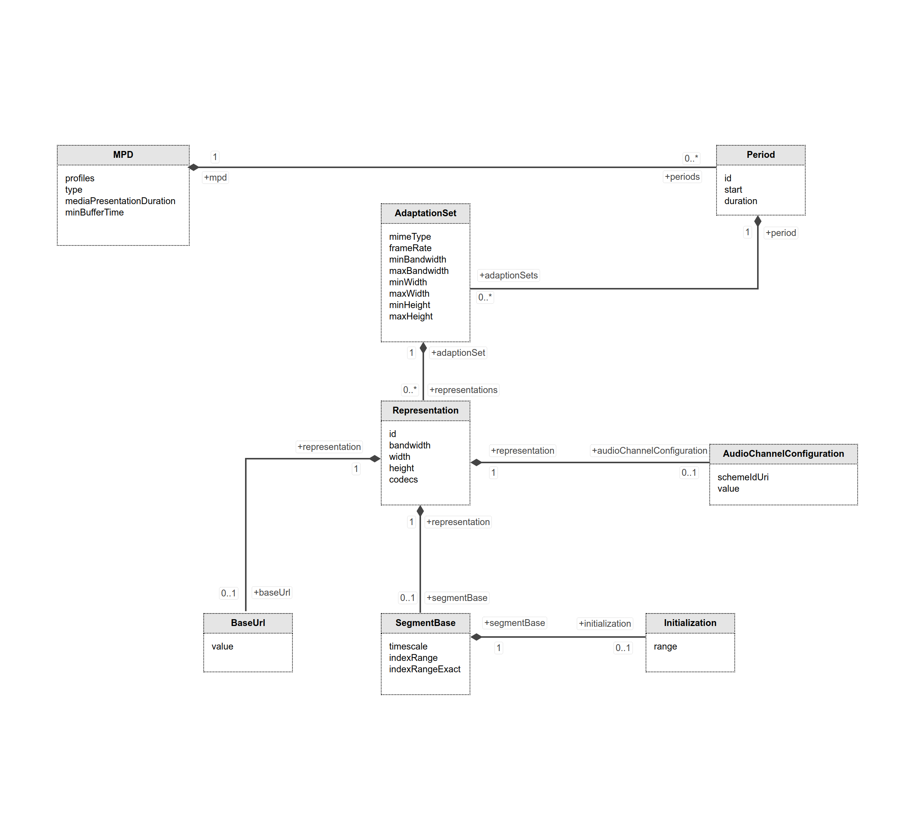

### Welcome to DASHEncoder

### ❄ How does it work?
DASHEncoder generates fragmented MP4 files and a MPD file based on a given list of input audio/video files.
It takes encoded video and audio from an array of different formats and repackages them as valid DASH streams.

Prerequisites:
---------------

* [java 8](http://www.oracle.com/technetwork/java/javase/downloads/index.html)
* [maven](https://maven.apache.org/)
* [ffmpeg](https://www.ffmpeg.org/download.html)
* [MP4 Parser](https://github.com/sannies/mp4parser/)

### 🌀 Build and run
Build
---------------
* Get the latest version from the git repository
* Run: mvn clean install

Run
---------------
Step 1 - Start the Server
---------------
 `java -jar essentialprogramming-dash-fragmenter.jar`
 
Step 2 - Upload audio/video files
---------------
 1. Open your browser and go to: localhost:8082/player.html 
 2. Select all generated files from the next step (FFMPEG)
 3. Submit - wait for them to appear in the project root (at the same level with the parent pom.xml file)  
 4. After the files are submitted, click Fragment - this should take a couple of seconds :  
    1. fragmented mp4 files will be generated in **/video-formatted** folder
    2. mpd file **(manifest.mpd)** will be generated at project root (at the same level with the parent pom.xml file)
    
# Tools

## FFMPEG    

### 1. FFMPEG commands

Download ffmpeg from https://ffmpeg.org/download.html

**For 160x90 bitrate 250k** **:**  

ffmpeg -i trailer.mp4 -s 160x90 -c:v libx264 -b:v 250k -g 90 -an input_video_160x90_250k.mp4

**For 320x180 bitrate 500k**

ffmpeg -i trailer.mp4 -s 320x180 -c:v libx264 -b:v 500k -g 90 -an input_video_320x180_500k.mp4

**For 640x360 bitrate 750k**

ffmpeg -i trailer.mp4 -s 640x360 -c:v libx264 -b:v 750k -g 90 -an input_video_640x360_750k.mp4

**For 640x360 bitrate 1000k - run this**

ffmpeg -i trailer.mp4 -s 640x360 -c:v libx264 -b:v 1000k -g 90 -an input_video_640x360_1000k.mp4

**For 1280x720 bitrate 1500k** 

ffmpeg -i trailer.mp4 -s 1280x720 -c:v libx264 -b:v 1500k -g 90 -an input_video_1280x720_1500k.mp4

**For Audio**

ffmpeg -i trailer.mp4 -c:a aac -b:a 128k -vn input_audio_128k.mp4

## 💎 Quick introduction to MPEG DASH

At a very high level, an MPEG DASH presentation consists of an initial XML manfifest, called the Media Presentation Document (MPD for short), which describes media segments that form a complete presentation. Along with a number of attributes, the MPD allows the MPEG DASH player to compute the URL of each segment, and to download it and render it.

##  Periods
Periods, contained in the top-level MPD element, describe a part of the content with a start time and duration. Multiple Periods can be used for scenes or chapters, or to separate ads from program content.

## Adaptation Sets
Adaptation Sets contain a media stream or set of media streams. In the simplest case, a Period could have one Adaptation Set containing all audio and video for the content, but to reduce bandwidth, each stream can be split into a different Adaptation Set. A common case is to have one video Adaptation Set, and multiple audio Adaptation Sets (one for each supported language). Adaptation Sets can also contain subtitles or arbitrary metadata.

Adaptation Sets are usually chosen by the user, or by a user agent (web browser or TV) using the user's preferences (like their language or accessibility needs).

## Representations
Representations allow an Adaptation Set to contain the same content encoded in different ways. In most cases, Representations will be provided in multiple screen sizes and bandwidths. This allows clients to request the highest quality content that they can play without waiting to buffer, without wasting bandwith on unneeded pixels (a 720p TV doesn't need 1080p content). Representations can also be encoded with different codecs, allowing support for clients with different supported codecs (as occurs in browsers, with some supporting MPEG-4 AVC / h.264 and some supporting VP8), or to provide higher quality Representations to newer clients while still supporting legacy clients (providing both h.264 and h.265, for example). Multiple codecs can also be useful on battery-powered devices, where a device might chose an older codec because it has hardware support (lower battery usage), even if it has software support for a newer codec.

## Representations are usually chosen automatically, but some players allow users to override the choices (especially the resolution). A user might choose to make their own representation choices if they don't want to waste bandwidth in a particular video (maybe they only care about the audio), or if they're willing to have the video stop and buffer in exchange for higher quality.

## Media Segments
Media segments are the actual media files that the DASH client plays, generally by playing them back-to-back as if they were the same file (although things can get much more complicated when switching between representations).The two containers described by MPEG are the ISO Base Media File Format (ISOBMFF), which is similar to the MPEG-4 container format, and MPEG-TS. WebM in DASH is described in a document on the WebM project's wiki.

Media Segment locations can be described using BaseURL for a single-segment Representation, a list of segments (SegmentList) or a template (SegmentTemplate). Information that applies to all segments can be found in a SegmentBase. Segment start times and durations can be described with a SegmentTimeline (especially important for live streaming, so a client can quickly determine the latest segment). This information can also appear at higher levels in the MPD, in which case the information provides is the default unless overridden by information lower in the XML hierarchy. This is particularly useful with SegmentTemplate.

Segments can be in separate files (common for live streaming), or they can be byte ranges within a single file (common for static / "on-demand").

## Index Segments
Index Segments come in two types: one Representation Index Segment for the entire Representation, or a Single Index Segment per Media Segment. A Representation Index Segment is always a separate file, but a Single Index Segment can be a byte range in the same file as the Media Segment.

Index Segments contain ISOBMFF 'sidx' boxes, with information about Media Segment durations (in both bytes and time), stream access point types, and optionally subsegment information in 'ssix' boxes (the same information, but within segments).

The indexRange is the range of bytes within this segment that represents the segment index (the sidx box in the mp4 file) and the Initialization element indicates the range of bytes that includes any relevant initialization data (the various header boxes in the mp4 file)

## 💎  MP4 and DASH
 Mp4 needs to be "fragmented." From ISO BMFF Byte Stream Format §3:
  ### An ISO BMFF initialization segment is defined in this specification as a single File Type Box (ftyp) followed by a single Movie Header Box (moov).
  
## HOW TO CHECK IF YOUR MP4 IS PROPERLY FRAGMENTED ?
 I recommend [axiomatic-systems/Bento4](https://github.com/axiomatic-systems/Bento4) on GitHub.

  $ ./mp4dump ~/Movies/devtools.mp4 | head
  `[ftyp] size=8+28  
    ...  
  [moov] size=8+1109  
    ...  
  [moof] size=8+600  
    ...  
  [mdat] size=8+138679  
  [moof] size=8+536  
    ...  
  [mdat] size=8+24490  
    ...  
  ...  
  ...  
   `
    
Links:
---------------

* [MPD](https://dashif-documents.azurewebsites.net/DASH-IF-IOP/master/DASH-IF-IOP.html#timing-period)
* [MP4](https://www.sciencedirect.com/science/article/pii/S1742287614000140#tbl2)
* [Elements of the H.264 Video/AAC Audio](https://www.cimarronsystems.com/wp-content/uploads/2017/04/Elements-of-the-H.264-VideoAAC-Audio-MP4-Movie-v2_0.pdf)
* [HEVC (H.265) Vs. AVC (H.264) - What’s The Difference?](https://www.boxcast.com/blog/hevc-h.265-vs.-h.264-avc-whats-the-difference)

